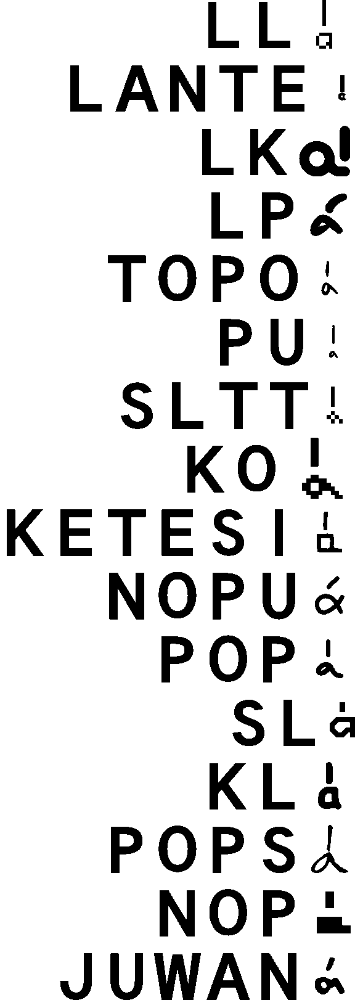

This font enables you to 
* read sitelen pona content (including UCSUR text) if you only know Latin script
* deconstruct cartouched names (including nasin sitelen kalama)
* autocartouche names that start with one uppercase letter followed by lowercase letters
* use other fonts through this one font

# Multifont function

Here are the fonts included in this project:

font name | help command | font switch command
--- | --- | ---
`(overview)`|HELP| 
`(randomised)` | HELP0 | RAND
leko lili 15x15 | HELP1 | LL
linja ante | HELP2 | LANTE
linja Kita | HELP3 | LK
linja pimeja (pona) | HELP4 | LP
nasin sitelen musi tan nasa Topo | HELP5 | TOPO
nasin sitelen pu mono | HELP6 | PU
sitelen luka tu tu | HELP7 | SLTT
sitelen pi linja ko | HELP8 | KO
sitelen Ketesi nasa | HELP9 | KETESI
sitelen linja tan jan Nopu | HELP10 | NOPU
sitelen pi suwi nasa tan ilo Popsie | HELP11 | POP
insa pi supa lape | HELP12 | SL
kisa lili | HELP13 | KL
suli lukin tan ilo Popsie | HELP14 | POPS
poka luka tan jan Nopu | HELP15 | NOP
sitelen Juwan | HELP16 | JUWAN

